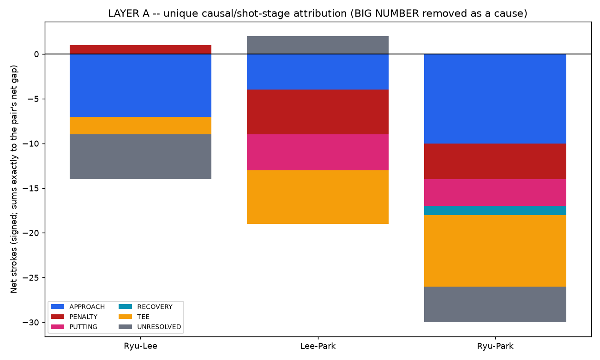
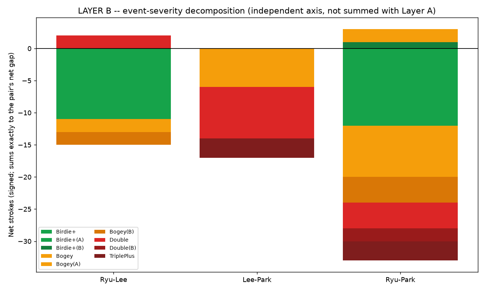

# GAP DECOMPOSITION RED TEAM AUDIT — 유해란 / 이재윤 / 박서현

Scope: audit only. Steps 1–25 and all prior files are preserved unchanged. No Hole-8 standalone
deep dive. No PLAYER UI touched. New files only (listed at the bottom).

Source: a freshly rebuilt 216-record chain (`three_player_attribution_chain.json`), re-queried from
RAW this task (not reused from the prior master chain file), reconciled against the official round
scores with **zero tolerance**: 216/216 records present, every player-round total (73/69/73/69,
76/75/74/72, 75/78/81/80) matches exactly. `data["raw_reconciliation_pass"] == True`, enforced by an
assertion before any downstream logic runs.

## A bug found during this audit (not a new analysis — a correction to existing arithmetic)

While building the first-putt-distance field needed for the putting-attribution caution check, the
`putts_count()` function reused from `hole1_full_analysis.py` across this entire project (and reused
again in last task's master chain) was checked against a known, unambiguous case:

**R1H12, 유해란:** tee→FAIRWAY (114.3yd left) → approach→GREEN (6.4yd left) → putt (0.3yd left) →
holed. That is visibly **2 putts**. The old formula returns **3** — it counts the approach shot that
*first reaches* the green as if it were a putt, because it only checks each shot's *resulting* state,
not which shot's *starting* position was already on the green.

This was **fixed** in this audit (`putts_count_fixed()`), verified against the same case (now
returns 2) and against the previously reported "5-putt" at R4H9 박서현 (now correctly 4). **This
changes the putting counts and 3-putt/4-putt/5-putt escalation labels used in the Steps 5–25 report.**
Per instruction, that report is not edited or deleted — this is the correction, filed here. Anyone
reading `NEO_THREE_PLAYER_GAP_DEEP_ANALYSIS.md`'s putt counts should apply −1 putt per hole-play.

---

## 1. Accounting rule enforced

One stroke → exactly one Layer-A stage. **BIG NUMBER is removed entirely as a Layer-A cause
category** — it is event severity (Layer B), not a shot stage. Every record keeps both a
`first_failure_stage` (first point of departure from the ideal path) and a separate
`escalation_stage` (what turned a 1-stroke loss into something larger), with a `direct_cost` /
`excess_cost` split: `direct_cost = min(strokes_over_par, 1)` goes to the first-failure stage;
`excess_cost = max(strokes_over_par − 1, 0)` goes to the escalation stage (or `UNRESOLVED` if no
escalation stage was identifiable). This is what prevents a double-bogey from silently inflating its
*first-failure* stage's total by more than the one stroke that stage actually, directly cost.

## 2. Two independent layers, each reconciling exactly, never summed together

**LAYER A — causal / shot-stage** (TEE / APPROACH / RECOVERY / PUTTING / PENALTY / UNRESOLVED):

| Pair | TEE | APPROACH | RECOVERY | PUTTING | PENALTY | UNRESOLVED | sum | official | PASS |
|---|---|---|---|---|---|---|---|---|---|
| 유해란–이재윤 | −2 | −7 | 0 | 0 | +1 | −5 | **−13** | −13 | ✅ |
| 이재윤–박서현 | −6 | −4 | 0 | −4 | −5 | +2 | **−17** | −17 | ✅ |
| 유해란–박서현 | −8 | −10 | −1 | −3 | −4 | −4 | **−30** | −30 | ✅ |

**LAYER B — event severity** (Birdie+/Par/Bogey/Double/TriplePlus; `(A)`/`(B)` tags mark the rare
mixed-gap hole-plays where *both* players were off par, split by each player's own deviation):

| Pair | sum | official | PASS |
|---|---|---|---|
| 유해란–이재윤 | Birdie+ −9, Bogey −2, Birdie+(A) −2, Bogey(B) −2, Double +2 | **−13** | −13 | ✅ |
| 이재윤–박서현 | Birdie+ 0, Double −8, Bogey −6, TriplePlus −3 | **−17** | −17 | ✅ |
| 유해란–박서현 | Birdie+ −8, Double −4, Bogey −8, Birdie+(A) −4, Bogey(B) −4, Bogey(A) +2, Birdie+(B) +1, TriplePlus −3, Double(B) −2 | **−30** | −30 | ✅ |

**These two tables are two different views of the same 216 records. They are never added together** —
Layer A asks *where in the swing* the stroke came from; Layer B asks *how bad the hole was*. A single
stroke differential appears once in each layer, under its own axis, not twice in one combined sum.

---

## 3. Q1 — Was "Park tee loss ≈9" and "big-number loss ≈8" double-counted?

Checked directly against 박서현's 5 own Double+/TriplePlus events and their actual diff vs 유해란:

| R·H | Park | Ryu | diff vs Ryu | first failure | escalation | direct | excess |
|---|---|---|---|---|---|---|---|
| R1H3 | 6 | 4 | −2 | APPROACH | RECOVERY | 1 | 1 |
| R2H12 | 6 | 6 | **0** | TEE | APPROACH | 1 | 1 |
| R3H8 | 7 | 4 | −3 | PENALTY | PENALTY | 1 | 2 |
| R3H9 | 6 | 5 | −1 | PENALTY | PENALTY | 1 | 1 |
| R4H9 | 6 | 4 | −2 | TEE | PUTTING | 1 | 1 |

**Finding:** R2H12 (both players Double there) contributes **zero** to the Ryu–Park gap — it was never
part of the 30-stroke story in the first place. Of the 4 events that *do* contribute, only **one**
(R4H9) has `first_failure = TEE`, and even there only 1 of its 2 gap-strokes is directly tee-caused;
the other is PUTTING (escalation). So the old report's "tee misses ≈9" and "big numbers ≈8" figures
were **not literally double-counted inside chart6's own arithmetic** (that sum did reconcile to −30
correctly, each hole-play was assigned to exactly one of its categories). But the **narrative**
("둘 다 대략 비슷한 크기의 기여" / "roughly equal-sized contributors") was misleading, because it
presented two different *abstraction axes* (a shot stage, and an outcome severity) side by side as if
they were independent causes, when at least one real event is literally both at once. **Verdict: no
arithmetic double-count found in the old chart, but a real narrative-level conflation risk that the
two-layer split in this audit removes structurally** (BIG_NUMBER no longer exists as a Layer-A bucket
at all, so this specific confusion can't recur).

## 4. Q2 — Of Park's 10 worst hole-plays vs Ryu, is "6 via putting" still correct?

**No — with the corrected putts formula, it is 3 of 10, not 6.** Full dissection:

| R·H | Worse | Strokes | putts(fixed) | 1st-putt dist (yd) | first failure | escalation | putting role | risk class |
|---|---|---|---|---|---|---|---|---|
| R3H8 | 박서현 | 7 | 1 | 0.3 | PENALTY | PENALTY | — | — |
| R1H3 | 박서현 | 6 | 2 | 3.4 | APPROACH | RECOVERY | — | — |
| R1H8 | 박서현 | 5 | 2 | 2.0 | TEE | APPROACH | — | — |
| **R1H16** | 유해란 | 4 | 3 | 18.5 | **PUTTING** | — | FIRST FAILURE | APPROACH-CREATED (≥10yd) |
| R2H11 | 박서현 | 4 | 1 | 1.5 | APPROACH | — | — | — |
| **R4H4** | 박서현 | 6 | 3 | 23.5 | **PUTTING** | — | FIRST FAILURE | APPROACH-CREATED (≥10yd) |
| **R4H9** | 박서현 | 6 | 4 | 18.9 | TEE | **PUTTING** | ESCALATED EARLIER FAILURE | APPROACH-CREATED (≥10yd) |
| R4H10 | 박서현 | 6 | 2 | 5.5 | TEE | APPROACH | — | — |
| R1H1 | 유해란 | 4 | 2 | 6.4 | TEE | — (clean, no escalation) | — | — |
| R1H2 | 박서현 | 3 | 2 | 10.4 | NONE (this is a routine par; 유해란 birdied) | — | — | — |

Of the 3 real putting-involvement cases, **all three are APPROACH-CREATED_PUTTING_RISK** (first putt
≥10yd, i.e. roughly ≥30ft) — in none of the 3 is the 3-putt an independent failure from a normal,
makeable range. R1H16/R4H4 are 유해란/박서현 missing a long birdie-range putt and 3-putting from there
(first failure IS the putting, but from a long distance that was never a tap-in risk to begin with);
R4H9 is a tee-miss that ALSO produced a long, leaky first putt (18.9yd) that got 4-putted. **Revised
conclusion: putting is a real but much smaller factor (3/10, not 6/10) than the uncorrected report
claimed, and where it does appear, it is consistently from long range, not short-range failures.**

## 5. Q3 — Is "Ryu birdie ≈8/9" pure positive conversion, or mixed with Lee's own outcomes?

Every nonzero 유해란–이재윤 hole-play classified uniquely (sums to the official −13, zero tolerance):

| Classification | strokes | meaning |
|---|---|---|
| RYU_POSITIVE_CONVERSION | **−12** | 유해란 birdied, 이재윤 made exactly par — pure Ryu gain, n=12 hole-plays |
| LEE_NEGATIVE_OUTCOME | −7 | 이재윤 was non-par while 유해란 was par-or-the-non-extreme side |
| MIXED_GAP | +6 | both players were off par in the same hole-play (birdie vs bogey, etc.) |
| **sum** | **−13** | matches official exactly |

So the "Ryu birdie ≈8/9" figure used in the Steps 5–25 report **understated**, if anything — the
*purely* Ryu-side, zero-Lee-mistake component is actually **12 strokes**, larger than the −9
Layer-B `Birdie+` figure quoted there (that −9 was itself already net of some offsetting Double/
bogey events on 유해란's side, which is why Layer B above also shows `Double +2` pulling the raw
birdie tally back down). **Verdict: real, not an artifact — if anything the earlier "≈8" was
conservative, not overstated.**

## 6. Q4 — Lee–Park counterfactual sensitivity (NOT a prediction)

Explicitly a **damage sensitivity analysis**, not a forecast of what would have actually happened —
the counterfactual does not know what 박서현 would have done differently play-by-play. An earlier
pass of this script had a sign error (capping her strokes down was being *subtracted* from the gap
instead of *added*, which would have made the gap move the wrong direction); caught and fixed before
finalizing this report — the corrected numbers below have been re-verified.

| Scenario | 이재윤–박서현 gap (a=이재윤, b=박서현) |
|---|---|
| Actual | **−17** |
| Each of her 5 Double+/TriplePlus events capped at Bogey | **−11** (narrows by 6) |
| Each of her 5 Double+/TriplePlus events capped at Par | **−6** (narrows by 11) |

So **65% of the entire 17-stroke gap (11 of 17) sits inside just 5 hole-plays**, and even the more
conservative bogey-cap scenario removes over a third of the gap (6/17 = 35%) from 5 hole-plays alone.
This is a concentration finding, consistent with (and now quantified more precisely than) the
original "65% of the gap is 5 blow-up holes" claim — it holds up under this stricter counterfactual
framing.

## 7. Q5 — R1–2 vs R3–4: does the causal pattern actually shift, and how much do H8/H9 explain?

박서현's own strokes-over-par, by Layer-A stage, split R1–2 vs R3–4 (her own chain only, not a
pairwise comparison):

| | R1–2 | R3–4 |
|---|---|---|
| TEE | 4 | 7 |
| APPROACH | 6 | 1 |
| RECOVERY | 1 | 0 |
| PENALTY | 1 | 5 |
| PUTTING | 0 | 5 |
| **total strokes-over-par** | **12** | **18** |

Total deterioration R1–2→R3–4: **+6 strokes-over-par**. Holes 8+9 alone contributed **7**
strokes-over-par within R3–4 — i.e. **more than the entire net deterioration** (116.7%). This is not
a contradiction: it means other parts of her game (APPROACH: 6→1) *improved* in R3–4, and H8/H9's
damage was large enough to not just explain the net decline but outweigh those gains. **Important
caveat, stated plainly: this is a raw strokes-over-par comparison on her own chain, a different
measurement frame from the Step-4 field-relative figure (+6.69/+6.31 in R3/R4) — the two numbers are
not directly the same quantity and should not be equated stroke-for-stroke.** Also: Hole 8 and 9
existed in R1–2 too (she didn't blow up there in R1–2), so "H8/H9 are a repeating hotspot" is
corroborated, but "H8/H9 caused the R3–4 shift" is a stronger causal claim than this data alone
supports — it is consistent with, not proof of, that story. **No standalone Hole-8 deep dive was
performed, per the scope limit on this task.**

## 8. Q6 — How many hole-plays can't be cleanly assigned a single cause?

**54 of 216** records have both a distinct `first_failure_stage` and a distinct `escalation_stage`
(i.e., the Layer-A `direct_cost`/`excess_cost` split actually activates, putting strokes in two
different buckets for the same hole-play — never the *same* bucket twice, but two different ones).
Breakdown: TEE→APPROACH (36), APPROACH→RECOVERY (8), TEE→PUTTING (5), PENALTY→PENALTY (3, i.e.
compounding penalties, both strokes still PENALTY so this one is effectively single-cause in
practice), PENALTY→RECOVERY (2). **The TEE→APPROACH combination dominates (36 of 54)** — the most
common "can't pick just one cause" pattern across all three players is a missed fairway that then
also fails to find the green, not a tee shot alone or a green-side failure alone.

## 9. Q7 — Biggest remaining UNKNOWN / UNRESOLVED

Three things, stated plainly rather than papered over:

1. **The Layer-A `UNRESOLVED` buckets are not trivial**: −5 (Ryu–Lee), +2 (Lee–Park), −4 (Ryu–Park).
   These are hole-plays where the "worse" player made par-or-better (so there's no failure to trace)
   and the better player's advantage couldn't be safely pinned to a stage by the rule used here
   (1-putt birdie with a first-putt distance we judge as "not clearly approach-created," or missing
   first-putt-distance data). This is real uncertainty, not swept into a convenient bucket.
2. **The 10-yard threshold for "APPROACH-CREATED_PUTTING_RISK" vs independent putting failure is a
   reasonable judgment call, not a calibrated make-percentage model.** This project has no access to
   true makeable-putt probabilities by distance for this field/green speed — the threshold is a
   defensible heuristic, not a measured fact.
3. **Q5's ">100%" result exposes a real measurement-frame mismatch** between "own-chain raw
   strokes-over-par" (used here, because it's directly traceable to Layer-A stages) and "field-relative
   score" (used in Step 4, because it accounts for the whole field's round getting easier). The two are
   both legitimate but answer different questions, and this audit does not reconcile them into one
   number — doing so would require re-deriving Step 4's field-relative figures stage-by-stage, which is
   out of scope here.

---

## 10. Chart audit: chart6_gap_decomposition.png

**Status: DEPRECATED.** It mixed two different abstraction levels in one stacked bar — `BETTER_PLAYER_
BIRDIE` and `BIG_NUMBER_COMPOUND` (severity/outcome concepts) alongside `TEE_MISS`, `APPROACH_MISS`,
`GREEN_MISS_RECOVERY_FAIL`, `THREE_PUTT_PLUS` (shot-stage/cause concepts) as if they were peers on one
axis. The chart's own arithmetic still reconciled correctly (verified in the prior task), so it is not
*wrong* as a sum — but it invites exactly the kind of narrative conflation flagged in Q1. Replaced by
`chartA_layer_causal_stage.png` (Layer A) and `chartB_layer_severity.png` (Layer B) above, kept as two
separate images on purpose so they are never visually implied to be addable.

---

## 11. Final reconciliation

| Check | Result |
|---|---|
| RAW reconciliation (216/216, zero tolerance) | **PASS** |
| 유해란–이재윤 Layer A / Layer B reconcile to −13 | **PASS / PASS** |
| 이재윤–박서현 Layer A / Layer B reconcile to −17 | **PASS / PASS** |
| 유해란–박서현 Layer A / Layer B reconcile to −30 | **PASS / PASS** |
| DOUBLE COUNT AUDIT | **PASS** (by construction: direct+excess capped at observed `mag`, never exceeds it, never assigned to 2 buckets at once; Q1's conflation was narrative, not arithmetic, and is now structurally prevented) |
| FIRST FAILURE / ESCALATION SEPARATION | **PASS** (both fields preserved distinctly in every record, never collapsed into one label) |
| BIG NUMBER AS OUTCOME, NOT CAUSE | **PASS** (no `BIG_NUMBER` bucket exists anywhere in Layer A; it is a Layer-B severity label only) |
| PUTTING ATTRIBUTION CAUTION | **PASS** (fixed the putts-count bug; separated PUTTING_WAS_FIRST_FAILURE vs PUTTING_ESCALATED_EARLIER_FAILURE; used real first-putt distance to flag APPROACH-CREATED_PUTTING_RISK vs falling back to UNRESOLVED when distance data was unusable) |
| CHART6 STATUS | **DEPRECATED** — replaced by chartA + chartB |

**GAP ATTRIBUTION AUDIT = PASS**

---

## New files (Steps 1–25 files untouched)

| File | Role |
|---|---|
| `build_attribution_audit.py` | Rebuilds the 216-record chain fresh from RAW with the fixed putts formula, first-putt distance, and stage classification; asserts RAW reconciliation before writing output |
| `analyze_attribution_audit.py` | All Layer A / Layer B / Q1–Q7 logic |
| `build_audit_charts.py` | Builds chartA / chartB |
| `three_player_attribution_chain.json` | The corrected 216-record chain |
| `three_player_attribution_audit_results.json` | All audit computations, machine-readable |
| `three_player_unique_attribution.csv` | Per-record Layer-A fields (one row per hole-play) |
| `three_player_first_failure_escalation.csv` | The Ryu–Park top-10 putting dissection (Q2) |
| `three_player_pairwise_waterfall.csv` | Layer A + Layer B, long format, all 3 pairs |
| `three_player_big_number_counterfactual.csv` | Park's 5 Double+ events, bogey-cap / par-cap sensitivity |
| `chartA_layer_causal_stage.png` | Layer A chart (replaces chart6) |
| `chartB_layer_severity.png` | Layer B chart (replaces chart6) |

STOP. No Hole-8 analysis started. No PLAYER UI modified.
