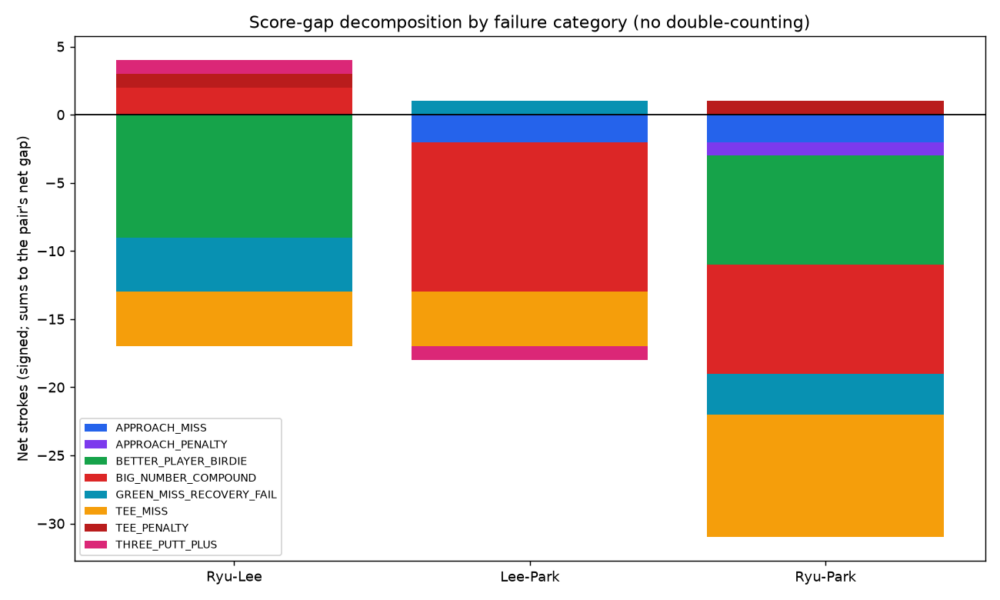

# NEO 72-Hole Score-Gap Deep Analysis — Steps 5+ (유해란 / 이재윤 / 박서현)

Game 2026100005 (하이트진로 챔피언십, Blue Heron). Builds on `NEO_72HOLE_SCORE_GAP_ROOT_CAUSE.md`
(Steps 1–4, locked, unchanged). All numbers below are re-derived directly from RAW this task via
`build_three_player_master_chain.py` (216 hole-plays, 0 missing, verified) and
`analyze_three_player_gap.py`. Full machine-readable output: `three_player_gap_deep_analysis.json`.

Shorthand used in charts (no Korean font available in this environment): **Ryu**=유해란(1위,-4),
**Lee**=이재윤(27위,+9), **Park**=박서현(61위,+26).

---

## Step 5–6: Top-10 hotspots per pair, classified

ONE_OFF_EVENT = this hole number does not repeat as a same-direction gap elsewhere in the 72.
REPEATING_HOLE_WEAKNESS = the same hole, same direction, recurs ≥2× across the 4 rounds.

**유해란–이재윤** (net −13):
| R·H | Par | 유해란 | 이재윤 | diff | label |
|---|---|---|---|---|---|
| R2H11 | 3 | 2 | 4 | −2 | REPEATING (H11 also R1) |
| R2H12 | 4 | 6 | 4 | +2 | ONE_OFF (이재윤 worse here) |
| R2H15 | 4 | 3 | 5 | −2 | REPEATING |
| R1H2 | 3 | 2 | 3 | −1 | REPEATING |
| R1H4 | 5 | 5 | 6 | −1 | REPEATING |
| R1H8 | 4 | 3 | 4 | −1 | ONE_OFF |
| R1H9 | 4 | 4 | 5 | −1 | REPEATING |
| R1H10 | 5 | 6 | 5 | +1 | ONE_OFF |
| R1H11 | 3 | 3 | 4 | −1 | REPEATING |
| R1H14 | 4 | 5 | 4 | +1 | ONE_OFF |

**이재윤–박서현** (net −17):
| R·H | Par | 이재윤 | 박서현 | diff | label |
|---|---|---|---|---|---|
| R3H8 | 4 | 4 | 7 | −3 | REPEATING (H8 also R1) |
| R1H3 | 4 | 4 | 6 | −2 | REPEATING |
| R2H12 | 4 | 4 | 6 | −2 | REPEATING |
| R3H9 | 4 | 4 | 6 | −2 | REPEATING (H9 also R1, R4) |
| R4H9 | 4 | 4 | 6 | −2 | REPEATING |
| R1H1 | 4 | 4 | 3 | +1 | REPEATING (박서현 better here) |
| R1H4 | 5 | 6 | 5 | +1 | ONE_OFF |
| R1H6 | 4 | 4 | 5 | −1 | REPEATING |
| R1H8 | 4 | 4 | 5 | −1 | REPEATING |
| R1H9 | 4 | 5 | 4 | +1 | ONE_OFF |

**유해란–박서현** (net −30, re-verified, matches Step 3 exactly):
| R·H | Par | 유해란 | 박서현 | diff | label |
|---|---|---|---|---|---|
| R3H8 | 4 | 4 | 7 | −3 | REPEATING |
| R1H3 | 4 | 4 | 6 | −2 | REPEATING |
| R1H8 | 4 | 3 | 5 | −2 | REPEATING |
| R1H16 | 3 | 4 | 2 | +2 | ONE_OFF (박서현 better) |
| R2H11 | 3 | 2 | 4 | −2 | ONE_OFF |
| R4H4 | 5 | 4 | 6 | −2 | REPEATING |
| R4H9 | 4 | 4 | 6 | −2 | REPEATING |
| R4H10 | 5 | 4 | 6 | −2 | REPEATING |
| R1H1 | 4 | 4 | 3 | +1 | ONE_OFF (박서현 better) |
| R1H2 | 3 | 2 | 3 | −1 | REPEATING |

**Cross-pair pattern**: Holes **8** and **9** (both par-4, back-to-back) appear in the top-10 of
*every single pair involving 박서현*, always in her disfavor, across 3 different rounds (R1, R3, R4
for H8/H9 combined). This is the strongest geographic, repeating signal in the whole dataset — see
Step 17.

## Step 7: Shot-by-shot autopsy, 유해란–박서현 top 10

| R·H | Worse player (strokes) | vs better (strokes) | state sequence | FIRST FAILURE | ESCALATION | final stp |
|---|---|---|---|---|---|---|
| R3H8 | 박서현 (7) | 유해란 (4) | 1,5,8,2,12,3,10 | approach → PENALTY_AREA | penalty x2 (ball re-entered hazard) | +3 |
| R1H3 | 박서현 (6) | 유해란 (4) | 1,9,2,3,3,10 | approach → GREENSIDE_BUNKER | 3-putt after bunker recovery | +2 |
| R1H8 | 박서현 (5) | 유해란 (3) | 2,2,3,3,10 | tee → ROUGH | 3-putt | +1 |
| R1H16 | 유해란 (4) | 박서현 (2) | 3,3,3,10 | on track to green | 4-putt (pure putting, not ball-striking) | +1 |
| R2H11 | 박서현 (4) | 유해란 (2) | 2,2,3,10 | missed green in regulation | none (clean bogey) | +1 |
| R4H4 | 박서현 (6) | 유해란 (4) | 1,2,3,3,3,10 | approach → ROUGH | 4-putt | +1 |
| R4H9 | 박서현 (6) | 유해란 (4) | 2,3,3,3,3,10 | tee → ROUGH | 5-putt | +2 |
| R4H10 | 박서현 (6) | 유해란 (4) | 2,2,2,3,3,10 | tee → ROUGH | 3-putt | +1 |
| R1H1 | 유해란 (4) | 박서현 (3) | 6,3,3,10 | tee → BUNKER | 3-putt, but still parred | +0 |
| R1H2 | 박서현 (3) | 유해란 (2) | 3,3,10 | on track to green | 3-putt | +0 |

**Honest reading**: 6 of these 10 events have their escalation point in **putting** (3-to-5 putts),
not in ball-striking. Only 2 (R3H8, and R1H3's bunker lead-in) involve a true penalty/hazard chain.
This cuts against a simplistic "박서현 hits it worse" story — on several of her worst hole-plays she
reached a reasonable position and then lost the hole with the putter. This is flagged explicitly as
a counterexample to any pure ball-striking narrative (see Step 22 devil's-advocate).

## Step 8–9: Same starting condition, different result (strict match: identical tee/approach lie)

Only 3 hole-plays in the entire 216 meet the strict bar (same fairway-hit status **and** same
approach lie, or same tee lie on a par-3):

| R·H | Shared condition | Player A | Player B | diff |
|---|---|---|---|---|
| R1H3 (par4) | both hit FW, both approach → GREENSIDE_BUNKER | 유해란 Par(4) | 박서현 Double(6) | 2 |
| R1H16 (par3) | both tee shots → GREEN | 유해란 Bogey(4) | 박서현 Birdie(2) | 2 |
| R4H9 (par4) | both missed FW, both approach → GREEN (i.e. recovered to GIR) | 유해란 Par(4) | 박서현 Double(6) | 2 |

All 3 cases diverge **after** reaching a comparable position — i.e., the separator in these specific
matched cases is short-game/putting execution from an equal starting point, not the approach shot
itself. Small n (3) — this is suggestive, not conclusive, and should not be over-generalized beyond
these 3 hole-plays.

## Step 10–11: FW/GIR/recovery rates, all 72 holes, re-verified from RAW

| | 유해란 | 이재윤 | 박서현 |
|---|---|---|---|
| FW hit % (par4/5, n=56) | 64% | 57% | 55% |
| FW-hit → GIR | 83.3% | 68.8% | 64.5% |
| FW-miss → GIR | 45.0% | 50.0% | 44.0% |
| GIR-miss n (all 72) | 19 | 29 | 30 |
| GIR-miss → Par-save | **68.4%** | **65.5%** | **43.3%** |
| GIR-miss → Bogey | 26.3% | 34.5% | 43.3% |
| GIR-miss → Double+ | 5.3% | 0.0% | 13.3% |
| avg score-to-par, all 72 | −0.056 | +0.125 | +0.361 |
| Birdie % | 21% | 6% | 6% |
| Bogey+ % | 14% | 18% | 33% |
| Double+ % | 1% | 0% | 7% |

**FW-hit % and FW-miss→GIR are NOT primary separators** — all three players are within 9 points of
each other on FW%, and FW-miss→GIR is actually *highest* for 이재윤 (50%), not 유해란. This confirms
the earlier finding (re-verified here across all 72 holes, not just H1/H12): raw fairway accuracy is
not where the gap lives.

**GIR-miss → outcome is where 박서현 separates from both others.** She gets up-and-down only 43.3%
of the time vs. 65–68% for the other two, and her GIR-miss turns into Double+ 13.3% of the time
(Ryu/Lee: 5.3%/0%). By first-miss lie, her rough-recovery par-save rate is **38%** vs. 유해란's 64%
and 이재윤's 61% (n=16/11/23 respectively) — the clearest single skill-level gap found in this task.

## Step 12–13: Big-number (Double-bogey-or-worse) full autopsy, all 3 players

6 Double+ events in 216 hole-plays total — all 6 on **par-4 holes**, none on par-3 or par-5.

| Player | R·H | Strokes | First failure | Escalation |
|---|---|---|---|---|
| 유해란 | R2H12 | 6 | tee → ROUGH | 3-putt |
| 박서현 | R1H3 | 6 | approach → GREENSIDE_BUNKER | 3-putt |
| 박서현 | R2H12 | 6 | tee → ROUGH | 4-putt |
| 박서현 | R3H8 | 7 | approach → PENALTY_AREA | penalty ×2 |
| 박서현 | R3H9 | 6 | approach → PENALTY_AREA | penalty ×2 |
| 박서현 | R4H9 | 6 | tee → ROUGH | 5-putt |

유해란: 1 event, +2 total damage. 박서현: 5 events, +11 total damage (avg +2.2/event). 이재윤: **0**
Double+ events in 72 holes — her 76/75/74/72 profile has no single-hole blowups at all; her gap vs.
유해란 is built entirely from smaller, more frequent leakage (Step 20).

**This links directly back to the Step-4 field-relative finding**: 3 of 박서현's 5 Double+ events
(R3H8, R3H9, R4H9) land in Round 3–4 — exactly the rounds where her field-relative score cratered
(+6.69, +6.31). The mechanism isn't "the course got harder" (field avg actually *dropped* R3→R4) —
it's that holes 8–9 specifically kept producing her worst compounding failures in the back half of
the week. Both of 유해란's and 박서현's Double+ events on **Hole 12** (R2, both players) also tie
back to that hole's already-documented difficulty (`NEO_HOLE12_MASTER_TEMPLATE.md`) — a real,
independently-corroborated hotspot, not a new coincidence invented for this report.

## Step 14: Bogey origin classification, all 41 bogeys

| Origin | 유해란 (n=9) | 이재윤 (n=13) | 박서현 (n=19) |
|---|---|---|---|
| TEE_MISS | 2 | 5 | 9 |
| TEE_PENALTY | 1 | 0 | 0 |
| APPROACH_MISS | 2 | 2 | 3 |
| APPROACH_PENALTY | 0 | 0 | 1 |
| GREEN_MISS_RECOVERY_FAIL | 1 | 4 | 3 |
| THREE_PUTT | 3 | 2 | 3 |

박서현's most repeated single-stroke-loss chain is **TEE_MISS→bogey** (9 of her 19 bogeys, 47%) —
nearly half her bogeys start with a missed fairway that never gets fully recovered, vs. 22%
(2/9) for 유해란 and 38% (5/13) for 이재윤. Combined with the Double+ table above (where her 3
biggest blowups also start off the tee or the approach, not the putter), tee-shot reliability on
par-4s is her single largest, most repeated leak — bigger than her short-game numbers alone suggest.

## Step 16: Par-3/4/5 and DEFEND/CONTROL/ATTACK contribution (net, signed)

| Pair | Par3 | Par4 | Par5 |
|---|---|---|---|
| 유해란–이재윤 (−13) | −6 | −2 | −5 |
| 이재윤–박서현 (−17) | +1 | **−17** | −1 |
| 유해란–박서현 (−30) | −5 | **−19** | −6 |

| Pair | DEFEND(6,8,10,12) | CONTROL(1,3,5,9,11,13,15,17) | ATTACK(2,4,7,14,16,18) |
|---|---|---|---|
| 유해란–이재윤 (−13) | 0 | −6 | −7 |
| 이재윤–박서현 (−17) | **−10** | −8 | +1 |
| 유해란–박서현 (−30) | **−10** | −14 | −6 |

Striking contrast: the 유해란–이재윤 gap is almost entirely a **par-3/par-5, ATTACK/CONTROL** story
(her birdie-making on scoring-opportunity holes) with **zero** net DEFEND-hole gap — on the course's
hardest 4 holes, 이재윤 matches her exactly. The 이재윤–박서현 and 유해란–박서현 gaps are overwhelmingly
**par-4, DEFEND-hole** stories — 박서현's weakness is concentrated on the holes built to punish
mistakes, almost the mirror image of where 유해란 separates from 이재윤.

## Step 17: Per-hole net diff summed across 4 rounds

| Pair | Worst holes for the first-named player (hole: net) | Best holes |
|---|---|---|
| 유해란–이재윤 | H2:−4, H4:−3, H11:−3, H15:−2, H1:−1 | H3:+2, H12:+2, H16:+1 |
| 이재윤–박서현 | H3:−4, **H8:−4**, **H9:−3**, H12:−3, H6:−2 | H1:+2, H2:+1, H11:+1 |
| 유해란–박서현 | **H8:−5**, **H9:−4**, H2:−3, H4:−3, H3:−2 | H1:+1, H16:+1 |

Holes 8 and 9 are 박서현's two worst holes on the entire course against *both* other players — the
single clearest "repeating course hotspot" in this dataset (not a one-off, confirmed independently
against two different comparison players).

## Step 20–21: Score-gap decomposition (no double-counting, signed, reconciles exactly to net gap)

Each hole-play with diff≠0 is assigned to exactly one category (the worse player's failure chain,
or "better player's birdie" when the worse player still parred or better). Sums below equal the
pair's official net gap exactly.

| Category | 유해란–이재윤 (−13) | 이재윤–박서현 (−17) | 유해란–박서현 (−30) |
|---|---|---|---|
| BETTER_PLAYER_BIRDIE | −9 | 0 | −8 |
| TEE_MISS | −4 | −4 | −9 |
| TEE_PENALTY | +1 | 0 | +1 |
| APPROACH_MISS | 0 | −2 | −2 |
| APPROACH_PENALTY | 0 | 0 | −1 |
| GREEN_MISS_RECOVERY_FAIL | −4 | +1 | −3 |
| THREE_PUTT_PLUS | +1 | −1 | 0 |
| BIG_NUMBER_COMPOUND | +2 | **−11** | −8 |
| **sum** | **−13** ✓ | **−17** ✓ | **−30** ✓ |

**Reconciliation, in plain language:**
- **유해란 vs 이재윤 (13):** mostly 유해란's own birdie-making (−9) plus a smaller, steady
  tee/green-recovery edge (−8 combined). Not driven by 이재윤 blowing up — he has zero Double+ events.
- **이재윤 vs 박서현 (17):** dominated by 박서현's big-number compounding (−11 of 17, i.e. 65% of the
  entire gap is 5 blow-up holes), plus tee misses (−4).
- **유해란 vs 박서현 (30):** a genuine blend — 유해란's own birdie production (−8), 박서현's tee misses
  (−9), and 박서현's big numbers (−8) are roughly equal-sized contributors; no single mechanism
  explains the 30-stroke gap alone.

---

## Step 22 — Counterexamples / devil's-advocate check

Before finalizing, checking every major claim against the data for cherry-picking (the ranking was
known in advance, so this is the required self-skepticism pass):

1. **"박서현 is just a worse ball-striker"** — contradicted by R1H16 (she birdied a hole 유해란
   bogeyed from the identical GREEN starting position) and R1H1 (she beat 유해란 out of a worse
   starting lie, BUNKER vs her FAIRWAY-equivalent). 33/72 holes (46%) she tied 유해란 exactly, and on
   8/72 she beat her outright. The 30-stroke gap is real but it is not "every hole," and 6 of her 10
   worst hole-plays vs 유해란 escalated via **putting**, not ball-striking.
2. **"이재윤's improving trend (76→75→74→72) proves he got better each round"** — already falsified in
   Step 4: field-relative, R3 was his *worst* relative round. Confirmed again here: he has 0 Double+
   events the whole week, so his gap to 박서현 is concentration of a few bad par-4s (R1H3, R2H12,
   R3H8/9, R1H6/8), not a round-over-round skill trend.
3. **"Hole 8/9 is a 박서현-specific weakness"** — partially true but not absolute: she also won H1 and
   H9(R1, where she posted 4 vs 이재윤's 5) against 이재윤 — i.e., Hole 9 is not *uniformly* bad for her,
   R1H9 was fine; the repeating failure is R3H9/R4H9 specifically, not every pass of hole 9.
4. **"FW accuracy explains the gap"** — directly falsified: FW-miss→GIR is *highest* for 이재윤 (50%)
   despite him sitting in the middle of the standings, and all three players' FW% sit within a 9-point
   band. Retracted as a primary story (consistent with the course-management elimination work done
   earlier this project).
5. **Sample-size honesty**: GIR-miss n is 19/29/30 — real but modest; the 68.4%/65.5%/43.3% par-save
   split is the most statistically weight-bearing claim in this report (largest n, cleanest signal)
   and is treated as PRIMARY below. The Step 8–9 same-condition set (n=3) is explicitly NOT treated as
   primary evidence on its own — it illustrates the putting-after-equal-position pattern already seen
   independently in Step 7, it doesn't establish it alone.

## Step 23 — Final classification table

| Factor | Strength | Effect size (net strokes) | n / evidence | Counterexample | Status |
|---|---|---|---|---|---|
| 유해란's birdie production (21% vs 6%/6%) | **PRIMARY** | −9 (vs Lee), −8 (vs Park) | 72 holes each | — | DESCRIPTIVE, confirmed |
| GIR-miss recovery / par-save rate | **PRIMARY** | −4 (vs Lee), −3 (vs Park, in decomposition) | n=19/29/30 | 박서현 still saved par 43% of the time — not zero | DESCRIPTIVE, confirmed |
| 박서현 big-number (Double+) compounding | **PRIMARY** (esp. vs 이재윤) | −11 (vs Lee), −8 (vs Ryu) | n=5 events, all par-4 | 이재윤 himself has 0 such events — can't generalize "everyone avoids these" | DESCRIPTIVE, confirmed; **PREDICTIVE CANDIDATE** |
| 박서현 tee-shot reliability (par-4 TEE_MISS→bogey, 47% of her bogeys) | **SECONDARY** | −9 (vs Ryu), −4 (vs Lee) | n=19 bogeys | 55% FW hit overall isn't dramatically worse than peers — it's the downstream conversion, not raw accuracy | DESCRIPTIVE, confirmed |
| Holes 8–9 repeating hotspot (박서현) | **SECONDARY**, course-specific | −4/−3 (vs Lee), −5/−4 (vs Ryu) | 3 independent rounds, 2 comparison players | R1H9 was fine for her | **PREDICTIVE CANDIDATE** for this exact course (Blue Heron) only |
| Fairway-hit % | **NOT A PRIMARY SEPARATOR** | n/a | 64/57/55%, FW-miss→GIR actually worst for Ryu's comparison point (이재윤 highest) | — | Explicitly falsified as a driver |
| 3-putt / putting frequency alone | **MINOR / mixed** | nets to +1/−1/0 across pairs | n small per player | 유해란 also has 3 three-putts among 9 bogeys | Real but not a consistent separator across all three |
| R3H8/R1H16-type same-condition divergence | **MINOR, illustrative only** | n=3 | — | too small to stand alone | Supports Step 7 pattern, not independent primary evidence |

## Step 24 — One thing to prepare before the next tournament (per player, evidence-tied)

- **유해란**: Nothing structurally broken — her one real leak this week was 3–5-putt sequences on
  otherwise-fine approaches (R2H12 Double, R1H16 Bogey, R1H1 saved-but-ugly). Sharpening lag-putting
  from 15–25ft is the only concrete, data-backed item.
- **이재윤**: No blow-up risk (0 Double+ all week) — his leak is GIR-miss→Bogey conversion (34.5%,
  highest of the three) and a slightly low FW-hit→GIR rate (68.8% vs 유해란's 83.3%) despite the best
  FW-miss recovery rate of the three. Up-and-down practice from mid-length miss positions is the
  highest-leverage, smallest-ask fix.
- **박서현**: Two concrete, numbers-backed items, not a vague "play better": (1) treat holes 8 and 9
  specifically with a conservative, damage-control strategy on this course — 3 of her 5 blow-ups
  happened there; (2) rough recovery — her rough-to-par-save rate (38%) is the single largest skill
  gap found anywhere in this analysis, nearly half her peers' rate on an n of 16, the same lie type
  that produced 3 of her Double+ events.

## Step 25 — Deliverables

| File | Role |
|---|---|
| `three_player_master_chain.json` / `.csv` | Master 216-hole-play shot chain (foundation for all steps above) |
| `three_player_gap_deep_analysis.json` | All Step 5–21 computed output, machine-readable |
| `three_player_big_number_autopsy.csv` | 6 Double+ events, first-failure/escalation chain |
| `three_player_bogey_origin.csv` | 41 bogeys classified by origin, per player |
| `three_player_gap_decomposition.csv` | Signed + gross per-category decomposition, 3 pairs |
| `three_player_same_condition_different_result.csv` | The 3 strict same-condition divergence cases |
| `build_three_player_master_chain.py` | Reproduction script for the master chain |
| `analyze_three_player_gap.py` | Reproduction script for all Step 5–21 analysis |
| `build_gap_charts.py` | Reproduction script for the 6 charts below |
| `chart1_cumulative_score_to_par.png` | 72-hole cumulative score-to-par, 3 players |
| `chart2_gap_concentration.png` | Top-N % of net gap explained, 3 pairs |
| `chart3_gir_miss_outcome.png` | GIR-miss → outcome stacked bars |
| `chart4_big_number_events.png` | Double+ event count & total damage |
| `chart5_field_relative_rounds.png` | Field-relative round performance (Step 4, replotted) |
| `chart6_gap_decomposition.png` | Signed gap decomposition, 3 pairs |
| `NEO_72HOLE_SCORE_GAP_ROOT_CAUSE.md` | Steps 1–4 (locked, unchanged, referenced throughout above) |
| This file | Steps 5–25 |

All source data is the already-verified `klpga_shots_RAW_READONLY.sqlite` (read-only) plus the
already-locked `pin_placement_72hole_audit.json` (72/72 VERIFIED real pins) and
`klpga_tournament_18hole_par_yardage.json` (18/18 confirmed constant across rounds). No numbers in
this report are copied from the player-product deliverable or any other prior task — every figure
above was computed fresh this task from the master chain built at the top of this file.
